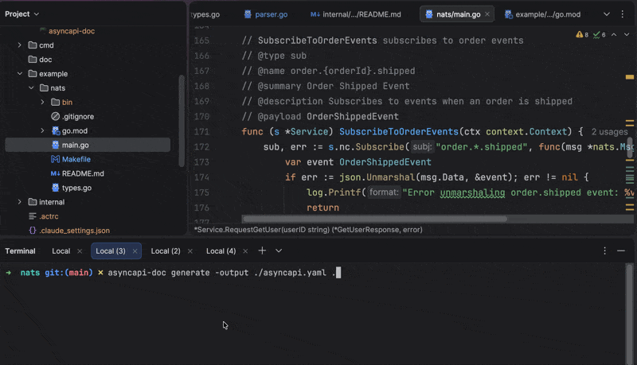

# AsyncAPI Generator

[](https://go.dev/doc/devel/release)
[](https://github.com/fedanant/asyncapi-doc/actions/workflows/ci.yml)
[](https://goreportcard.com/report/github.com/fedanant/asyncapi-doc)
[](https://codecov.io/gh/fedanant/asyncapi-doc)
[](https://pkg.go.dev/github.com/fedanant/asyncapi-doc)
[](LICENSE)
[](https://github.com/fedanant/asyncapi-doc/releases/latest)

AsyncAPI Generator is a code-to-spec tool that automatically generates AsyncAPI specifications from your Go code, similar to how [Swag](https://github.com/swaggo/swag) works for OpenAPI.



## Contents

- [Installation](#installation)
- [Quick Start](#quick-start)
- [AsyncAPI Annotations Reference](#asyncapi-annotations-reference)
  - [Service-Level Annotations](#service-level-annotations)
  - [Operation-Level Annotations](#operation-level-annotations)
  - [Parameterized Channels](#parameterized-channels)
  - [NATS Subject Patterns](#nats-subject-patterns)
  - [Complete Example](#complete-example)
  - [Supported Protocols](#supported-protocols)
  - [Tips](#tips)
- [Usage](#usage)
  - [Generate Command](#generate-command)
- [Examples](#examples)
- [Generating Documentation and Code from AsyncAPI Spec](#generating-documentation-and-code-from-asyncapi-spec)

## Installation

### Quick Install (Linux/macOS)

Install the latest version with a single command:

```bash
curl -fsSL https://raw.githubusercontent.com/fedanant/asyncapi-doc/main/install.sh | bash
```

### Download Pre-built Binaries

Download the latest release for your platform from the [releases page](https://github.com/fedanant/asyncapi-doc/releases/latest).

Available platforms:
- Linux (amd64, arm64)
- macOS (amd64, arm64)
- Windows (amd64, arm64)

### Using Go install

```bash
go install github.com/fedanant/asyncapi-doc/cmd/asyncapi-doc@latest
```

### Verify Installation

```bash
asyncapi-doc version
```

## Quick Start

### 1. Annotate your Go code with AsyncAPI comments

Add service-level annotations to your main function:

```go
// @title User Service API
// @version 1.0.0
// @description A comprehensive user management service for handling user events
// @termsOfService https://example.com/terms
// @contact.name API Support Team
// @contact.email support@example.com
// @contact.url https://example.com/support
// @license.name Apache 2.0
// @license.url https://www.apache.org/licenses/LICENSE-2.0.html
// @tag users - User management operations
// @tag events - Event handling
// @externalDocs.description Find more info here
// @externalDocs.url https://docs.example.com
// @protocol nats
// @url nats://localhost:4222

func main() {
    // Your application code
}
```

Add operation-level annotations to your publish/subscribe functions:

```go
// PublishUserCreated publishes a user creation event
// @type pub
// @name user.created
// @summary User Created Event
// @description Publishes an event when a new user is created in the system
// @payload UserCreatedEvent
func (s *Service) PublishUserCreated(event UserCreatedEvent) error {
    // Publish logic
    return nil
}

// SubscribeToOrders subscribes to order events
// @type sub
// @name order.{orderId}.placed
// @summary Order Placed Event
// @description Subscribes to order placement events with order ID parameter
// @payload OrderPlacedEvent
func (s *Service) SubscribeToOrders(ctx context.Context) error {
    // Subscribe logic
    return nil
}

// HandleGetUser handles user lookup requests with reply (request-reply pattern)
// @type sub
// @name user.get
// @summary Get User Request
// @description Handles user lookup requests and sends back user data
// @payload GetUserRequest
// @response GetUserResponse
func (s *Service) HandleGetUser(ctx context.Context) {
    // Subscribe to requests and reply with GetUserResponse
    // @response annotation automatically enables request-reply pattern
}
```

Define your event types with JSON tags:

```go
type UserCreatedEvent struct {
    UserID    string    `json:"userId"`
    Email     string    `json:"email"`
    Username  string    `json:"username"`
    CreatedAt time.Time `json:"createdAt"`
}

type OrderPlacedEvent struct {
    OrderID    string    `json:"orderId"`
    UserID     string    `json:"userId"`
    TotalPrice float64   `json:"totalPrice"`
    PlacedAt   time.Time `json:"placedAt"`
}

type GetUserRequest struct {
    UserID string `json:"userId"`
}

type GetUserResponse struct {
    UserID    string `json:"userId"`
    Email     string `json:"email"`
    Username  string `json:"username"`
    Found     bool   `json:"found"`
}
```

> **💡 Tips:** 
> - Use `@response` to automatically enable request-reply pattern (no need for `@type request`)
> - See the [AsyncAPI Annotations Reference](#asyncapi-annotations-reference) section below for complete documentation of all available annotations.

### 2. Generate AsyncAPI specification

```bash
asyncapi-doc generate -output ./asyncapi.yaml ./path/to/your/code
```

### 3. Generate HTML documentation (using AsyncAPI Generator)

Once you have your AsyncAPI specification, you can generate beautiful HTML documentation using the [AsyncAPI Generator](https://github.com/asyncapi/generator) (Node.js):

```bash
# Install AsyncAPI Generator (Node.js) globally
npm install -g @asyncapi/generator

# Generate HTML documentation from your spec
asyncapi generate fromTemplate ./asyncapi.yaml @asyncapi/html-template -o ./docs

# Open the generated documentation
open ./docs/index.html
```

**Alternative: Use AsyncAPI Studio**

You can also preview and validate your spec using [AsyncAPI Studio](https://studio.asyncapi.com):
- Visit https://studio.asyncapi.com
- Import your `asyncapi.yaml` file
- View documentation, validate the spec, and export to various formats

## AsyncAPI Annotations Reference

The generator uses special comment annotations (tags starting with `@`) to extract AsyncAPI information from your Go code.

### Service-Level Annotations

<details>
<summary>Click to expand Service-Level Annotations</summary>

Add these annotations to your `main()` function or package-level comments:

```go
// @title NATS Message Service
// @version 1.0.0
// @protocol nats
// @url nats://localhost:4222

func main() {
    // Your application code
}
```

**Available tags:**

| Tag | Description | Required | Example |
|-----|-------------|----------|---------|
| `@title` | API title/name | Yes | `@title Order Management API` |
| `@version` | API version | Yes | `@version 1.0.0` |
| `@description` | Brief description of the API's purpose and features | No | `@description This API handles order management events` |
| `@termsOfService` | URL or document specifying the API's terms of service | No | `@termsOfService https://example.com/terms` |
| `@contact.name` | Name of the API's owner or maintainer | No | `@contact.name API Support Team` |
| `@contact.email` | Contact email address | No | `@contact.email support@example.com` |
| `@contact.url` | Contact URL | No | `@contact.url https://example.com/support` |
| `@license.name` | API's license name | No | `@license.name Apache 2.0` |
| `@license.url` | API's license URL | No | `@license.url https://www.apache.org/licenses/LICENSE-2.0.html` |
| `@tag` | Keywords to organize and categorize API documentation (can be used multiple times) | No | `@tag orders - Order management operations` |
| `@externalDocs.description` | Description for external documentation | No | `@externalDocs.description Additional API documentation` |
| `@externalDocs.url` | URL to external documentation | No | `@externalDocs.url https://docs.example.com/api` |
| `@protocol` | Message protocol | Yes | `@protocol nats`, `@protocol amqp`, `@protocol mqtt` |
| `@protocolVersion` | Protocol version used for the connection | No | `@protocolVersion 1.0` |
| `@pathname` | Path to a resource in the host | No | `@pathname /api/events` |
| `@url` | Server URL (can be `@host` or `@url`) | Yes | `@url nats://localhost:4222` |
| `@host` | Server hostname (may include port) | Yes | `@host localhost:4222` |
| `@server.title` | Human-friendly title for the server | No | `@server.title Production NATS Server` |
| `@server.summary` | Brief overview of the server | No | `@server.summary Main production message broker` |
| `@server.description` | Description of the server | No | `@server.description Production NATS server for event streaming` |
| `@server.tag` | Keywords to logically group servers (can be used multiple times) | No | `@server.tag production - Production environment` |
| `@server.externalDocs.description` | Description for server external documentation | No | `@server.externalDocs.description Server setup guide` |
| `@server.externalDocs.url` | URL to server external documentation | No | `@server.externalDocs.url https://docs.example.com/nats` |

</details>

### Server Annotations

<details>
<summary>Click to expand Server Annotations</summary>

Server annotations allow you to provide detailed information about your message broker servers. These annotations enrich your AsyncAPI specification with metadata that helps consumers understand your server infrastructure.

#### Basic Server Configuration

```go
// @protocol nats
// @url nats://localhost:4222
```

#### Full Server Configuration Example

```go
// @protocol nats
// @protocolVersion 2.9
// @pathname /events
// @url nats://localhost:4222
// @server.title Production NATS Cluster
// @server.summary Main production message broker
// @server.description High-availability NATS cluster for production event streaming
// @server.tag production - Production environment
// @server.tag high-availability - HA cluster configuration
// @server.externalDocs.description NATS cluster setup and maintenance guide
// @server.externalDocs.url https://docs.example.com/nats/production-setup
```

#### Server Properties Reference

| Property | Annotation | Description | Example |
|----------|-----------|-------------|---------|
| Name | `@server.name` | Unique server identifier | `@server.name production` |
| Host | `@url` or `@host` | Server hostname with optional port | `@url nats://localhost:4222` |
| Protocol | `@protocol` | Messaging protocol | `@protocol nats` |
| Protocol Version | `@protocolVersion` | Version of the protocol | `@protocolVersion 2.9` |
| Pathname | `@pathname` | Path to resource in the host | `@pathname /api/events` |
| Title | `@server.title` | Human-friendly server title | `@server.title Production Server` |
| Summary | `@server.summary` | Brief server overview | `@server.summary Main message broker` |
| Description | `@server.description` | Detailed server description | `@server.description Production NATS cluster` |
| Tags | `@server.tag` | Keywords for logical grouping (multiple allowed) | `@server.tag production - Prod env` |
| External Docs | `@server.externalDocs.description` | External docs description | `@server.externalDocs.description Setup guide` |
| External Docs URL | `@server.externalDocs.url` | External docs URL | `@server.externalDocs.url https://docs.example.com` |
| Variable | `@server.variable` | Server variable definition | `@server.variable region enum=us,eu default=us description=Region` |
| Security | `@server.security` | Security scheme names (comma-separated) | `@server.security apiKey, oauth2` |
| Binding | `@server.binding` | Protocol-specific binding | `@server.binding nats.queue production-queue` |

#### Advanced Server Configuration

**Server Variables:**
```go
// @server.variable region enum=us-east,us-west,eu-west default=us-east description=Server region
// @server.variable environment enum=prod,staging,dev default=prod description=Environment name
```

**Server Security:**
```go
// @server.security apiKey
// @server.security apiKey, oauth2
```

**Server Bindings:**
```go
// @server.binding nats.queue production-queue
// @server.binding nats.deliverPolicy all
```

**Complete Example:**
```go
// @title Event Processing Service
// @version 2.0.0
// @description Distributed event processing service
// @protocol nats
// @protocolVersion 2.9
// @url nats://localhost:4222
// @server.name production
// @server.title Production NATS Cluster
// @server.summary Production event streaming cluster
// @server.description High-availability NATS cluster for production workloads
// @server.variable region enum=us-east,us-west,eu-west default=us-east description=Deployment region
// @server.security apiKey
// @server.binding nats.queue production-events
// @server.tag production - Production environment
// @server.tag cloud - Cloud deployment
// @server.externalDocs.description Server configuration guide
// @server.externalDocs.url https://docs.example.com/server-setup
func main() {
    // Application code
}
```

</details>

### Operation-Level Annotations

<details>
<summary>Click to expand Operation-Level Annotations</summary>

Add these annotations to functions that publish or subscribe to messages:

```go
// PublishUserCreated publishes a user creation event
// @type pub
// @name user.created
// @summary User Created Event
// @description Publishes an event when a new user is created
// @payload UserCreatedEvent
func (s *Service) PublishUserCreated() error {
    // Implementation
}

// SubscribeToUserUpdates subscribes to user update events
// @type sub
// @name user.updated
// @summary User Updated Event
// @description Subscribes to user update events with response
// @payload UserUpdatedEvent
// @response UserUpdateResponse
func (s *Service) SubscribeToUserUpdates(ctx context.Context) {
    // Implementation
}
```

**Available tags:**

#### Core Operation Tags

| Tag | Description | Required | Example |
|-----|-------------|----------|---------|
| `@type` | Operation type: `pub` (publish) or `sub` (subscribe) | Yes | `@type pub` |
| `@name` | Channel/topic name (supports parameters) | Yes | `@name order.{orderId}.placed` |
| `@summary` | Short operation summary | No | `@summary Order placed event` |
| `@description` | Detailed description | No | `@description Publishes when order is placed` |
| `@payload` | Go type name for message payload | Yes | `@payload OrderPlacedEvent` |
| `@response` | Go type name for response (automatically enables request-reply pattern) | No | `@response OrderResponse` |

#### Extended Operation Metadata

| Tag | Description | Example |
|-----|-------------|---------|
| `@operation.tag` | Tag to categorize operations (can use multiple times) | `@operation.tag users` |
| `@deprecated` | Mark operation as deprecated (true/false or just flag) | `@deprecated true` |
| `@security` | Comma-separated list of security scheme names | `@security apiKey, oauth2` |
| `@operation.externalDocs.description` | External documentation description | `@operation.externalDocs.description API Guide` |
| `@operation.externalDocs.url` | External documentation URL | `@operation.externalDocs.url https://docs.example.com` |

**Note:** In AsyncAPI 3.0.0, there is no `operationId` field. The operation key in the `operations` object serves as the unique identifier.

#### Channel Metadata

| Tag | Description | Example |
|-----|-------------|---------|
| `@channel.title` | Human-readable channel title | `@channel.title User Events Channel` |
| `@channel.description` | Detailed channel description | `@channel.description Broadcasts user lifecycle events` |

#### Message Metadata

| Tag | Description | Example |
|-----|-------------|---------|
| `@message.contenttype` | Content type of the message | `@message.contenttype application/json` |
| `@message.title` | Human-readable message title | `@message.title User Created Message` |
| `@message.tag` | Tag for message categorization (can use multiple times) | `@message.tag user-events` |
| `@message.headers` | Go type name for message headers schema | `@message.headers MessageHeaders` |
| `@message.correlationid` | Correlation ID field name in headers | `@message.correlationid correlationId` |

#### Protocol Bindings

##### NATS Bindings

| Tag | Description | Example |
|-----|-------------|---------|
| `@binding.nats.queue` | NATS queue group name | `@binding.nats.queue user-queue` |
| `@binding.nats.deliverPolicy` | NATS JetStream deliver policy | `@binding.nats.deliverPolicy all` |

##### AMQP Bindings

| Tag | Description | Example |
|-----|-------------|---------|
| `@binding.amqp.exchange` | AMQP exchange name | `@binding.amqp.exchange user-exchange` |
| `@binding.amqp.routingKey` | AMQP routing key pattern | `@binding.amqp.routingKey user.created` |

##### Kafka Bindings

| Tag | Description | Example |
|-----|-------------|---------|
| `@binding.kafka.topic` | Kafka topic name | `@binding.kafka.topic user-events` |
| `@binding.kafka.partitions` | Number of partitions | `@binding.kafka.partitions 3` |
| `@binding.kafka.replicas` | Number of replicas | `@binding.kafka.replicas 2` |

**Full Example with Extended Annotations:**

```go
// PublishUserCreated publishes a user creation event
// @type pub
// @name user.created
// @summary User Created Event
// @description Publishes an event when a new user is created in the system
// @payload UserCreatedEvent
// @operation.tag users
// @operation.tag events
// @security apiKey
// @operation.externalDocs.description User Creation Flow Documentation
// @operation.externalDocs.url https://docs.example.com/user-creation
// @channel.title User Creation Channel
// @channel.description Channel for broadcasting user creation events to all subscribers
// @message.contentType application/json
// @message.title User Created Message
// @message.tag user-events
// @binding.nats.queue user-creation-queue
func (s *Service) PublishUserCreated(event UserCreatedEvent) error {
    // Implementation
}
```

</details>

### Struct Field Tags

<details>
<summary>Click to expand Struct Field Tags and Validation Rules</summary>

AsyncAPI Generator supports special struct field tags to enhance the generated JSON Schema with validation rules, formatting, examples, and descriptions. These tags work with your existing Go structs to produce more detailed and accurate API specifications.

#### Available Tags

| Tag | Description | Example |
|-----|-------------|---------|
| `json` | Standard JSON tag for field naming and omitempty | `json:"email,omitempty"` |
| `description` | Field description in the schema | `description:"User email address"` |
| `example` | Example value (auto-typed based on field type) | `example:"user@example.com"` |
| `format` | JSON Schema format specifier | `format:"email"` |
| `required` | Explicitly mark field as required | `required:"true"` |
| `validate` | Validation rules (comma-separated) | `validate:"min=0,max=100"` |

#### go-playground/validator Compatibility

AsyncAPI Generator is **fully compatible** with [go-playground/validator/v10](https://pkg.go.dev/github.com/go-playground/validator/v10) tags. You can use the same `validate` tags you already use for runtime validation, and they will be automatically mapped to JSON Schema constraints in your AsyncAPI specification.

#### Validation Rules

The `validate` tag supports extensive validation rules that map to JSON Schema constraints:

##### Numeric Comparisons

| Rule | Description | JSON Schema | Example |
|------|-------------|-------------|---------|
| `min=N` | Minimum value/length | `minimum` or `minLength` | `validate:"min=0"` |
| `max=N` | Maximum value/length | `maximum` or `maxLength` | `validate:"max=100"` |
| `gte=N` | Greater than or equal | `minimum` | `validate:"gte=0"` |
| `lte=N` | Less than or equal | `maximum` | `validate:"lte=100"` |
| `gt=N` | Greater than (exclusive) | `exclusiveMinimum` | `validate:"gt=0"` |
| `lt=N` | Less than (exclusive) | `exclusiveMaximum` | `validate:"lt=100"` |
| `eq=N` | Equals | `const` | `validate:"eq=5"` |

##### String Length

| Rule | Description | JSON Schema | Example |
|------|-------------|-------------|---------|
| `min=N` | Minimum string length | `minLength` | `validate:"min=3"` |
| `max=N` | Maximum string length | `maxLength` | `validate:"max=255"` |
| `len=N` | Exact length | `minLength` & `maxLength` | `validate:"len=10"` |

##### String Patterns

| Rule | Description | JSON Schema | Example |
|------|-------------|-------------|---------|
| `alpha` | Alphabetic only | `pattern: ^[a-zA-Z]+$` | `validate:"alpha"` |
| `alphanum` | Alphanumeric | `pattern: ^[a-zA-Z0-9]+$` | `validate:"alphanum"` |
| `numeric` | Numeric digits | `pattern: ^[0-9]+$` | `validate:"numeric"` |
| `lowercase` | Lowercase only | `pattern: ^[a-z]+$` | `validate:"lowercase"` |
| `uppercase` | Uppercase only | `pattern: ^[A-Z]+$` | `validate:"uppercase"` |
| `hexadecimal` | Hex string | `pattern: ^[0-9a-fA-F]+$` | `validate:"hexadecimal"` |
| `hexcolor` | Hex color | `pattern: ^#[0-9a-fA-F]{3,6}$` | `validate:"hexcolor"` |
| `startswith=abc` | Starts with | `pattern: ^abc` | `validate:"startswith=user_"` |
| `endswith=xyz` | Ends with | `pattern: xyz$` | `validate:"endswith=.com"` |
| `contains=str` | Contains string | `pattern` | `validate:"contains=test"` |
| `pattern=regex` | Custom regex | `pattern` | `validate:"pattern=^[a-z]+$"` |

##### Format Validations

| Rule | Description | JSON Schema | Example |
|------|-------------|-------------|---------|
| `email` | Email address | `format: email` | `validate:"email"` |
| `url` | URL | `format: uri` | `validate:"url"` |
| `uri` | URI | `format: uri` | `validate:"uri"` |
| `uuid` | UUID (any version) | `format: uuid` | `validate:"uuid"` |
| `uuid4` | UUID v4 | `format: uuid` | `validate:"uuid4"` |
| `datetime` | Date-time | `format: date-time` | `validate:"datetime"` |
| `hostname` | Hostname | `format: hostname` | `validate:"hostname"` |
| `ipv4` | IPv4 address | `format: ipv4` | `validate:"ipv4"` |
| `ipv6` | IPv6 address | `format: ipv6` | `validate:"ipv6"` |
| `mac` | MAC address | `pattern` (MAC format) | `validate:"mac"` |
| `base64` | Base64 string | `format: base64` | `validate:"base64"` |
| `jwt` | JWT token | `pattern` (JWT format) | `validate:"jwt"` |
| `json` | JSON string | `contentMediaType: application/json` | `validate:"json"` |

##### Geographic

| Rule | Description | JSON Schema | Example |
|------|-------------|-------------|---------|
| `latitude` | Latitude (-90 to 90) | `minimum: -90, maximum: 90` | `validate:"latitude"` |
| `longitude` | Longitude (-180 to 180) | `minimum: -180, maximum: 180` | `validate:"longitude"` |

##### Network & Protocols

| Rule | Description | JSON Schema | Example |
|------|-------------|-------------|---------|
| `port` | Port number (1-65535) | `minimum: 1, maximum: 65535` | `validate:"port"` |
| `cidr` | CIDR notation | `pattern` (CIDR format) | `validate:"cidr"` |

##### Document Identifiers

| Rule | Description | JSON Schema | Example |
|------|-------------|-------------|---------|
| `isbn` | ISBN (10 or 13) | `pattern` (ISBN format) | `validate:"isbn"` |
| `isbn10` | ISBN-10 | `pattern` (ISBN-10 format) | `validate:"isbn10"` |
| `isbn13` | ISBN-13 | `pattern` (ISBN-13 format) | `validate:"isbn13"` |
| `issn` | ISSN | `pattern` (ISSN format) | `validate:"issn"` |

##### Financial & Identity

| Rule | Description | JSON Schema | Example |
|------|-------------|-------------|---------|
| `credit_card` | Credit card | `pattern` (CC format) | `validate:"credit_card"` |
| `btc_addr` | Bitcoin address | `pattern` (BTC format) | `validate:"btc_addr"` |
| `eth_addr` | Ethereum address | `pattern` (ETH format) | `validate:"eth_addr"` |
| `ssn` | Social Security Number | `pattern` (SSN format) | `validate:"ssn"` |

##### Versioning

| Rule | Description | JSON Schema | Example |
|------|-------------|-------------|---------|
| `semver` | Semantic version | `pattern` (semver format) | `validate:"semver"` |

##### Phone Numbers

| Rule | Description | JSON Schema | Example |
|------|-------------|-------------|---------|
| `e164` | E.164 phone format | `pattern` (E.164 format) | `validate:"e164"` |

##### Enum & Constants

| Rule | Description | JSON Schema | Example |
|------|-------------|-------------|---------|
| `oneof=v1\|v2` | Enum values | `enum` | `validate:"oneof=red\|green\|blue"` |
| `eq=value` | Constant value | `const` | `validate:"eq=active"` |

##### Array Validations

| Rule | Description | JSON Schema | Example |
|------|-------------|-------------|---------|
| `min=N` | Minimum items | `minItems` | `validate:"min=1"` |
| `max=N` | Maximum items | `maxItems` | `validate:"max=10"` |
| `unique` | Unique items | `uniqueItems: true` | `validate:"unique"` |
| `dive` | Validate elements | Applied to array items | `validate:"dive,min=1"` |

Multiple rules can be combined with commas: `validate:"required,min=0,max=100,email"`

#### Complete Example

```go
type UserCreatedEvent struct {
    // UserID is the unique identifier for the user
    UserID string `json:"userId" description:"Unique user identifier" example:"user-123" validate:"required,uuid4"`
    
    // Email address with format validation
    Email string `json:"email" description:"User email address" example:"user@example.com" validate:"required,email"`
    
    // Username with pattern validation
    Username string `json:"username" description:"User's display name" example:"johndoe" validate:"required,alphanum,min=3,max=20"`
    
    // Age with range validation
    Age int `json:"age" description:"User age in years" example:"25" validate:"required,gte=0,lte=150"`
    
    // Account type with enum validation
    AccountType string `json:"accountType" description:"Type of user account" example:"premium" validate:"required,oneof=free basic premium enterprise"`
    
    // Score with exclusive bounds
    Score float64 `json:"score,omitempty" description:"User score" example:"95.5" validate:"omitempty,gt=0,lt=100"`
    
    // Website URL
    Website string `json:"website,omitempty" description:"Personal website" example:"https://example.com" validate:"omitempty,url"`
    
    // Phone number in E.164 format
    Phone string `json:"phone,omitempty" description:"Phone number" example:"+12025551234" validate:"omitempty,e164"`
    
    // IP address
    IPAddress string `json:"ipAddress,omitempty" description:"User's IP address" example:"192.168.1.1" validate:"omitempty,ipv4"`
    
    // Hex color preference
    FavoriteColor string `json:"favoriteColor,omitempty" description:"Favorite color" example:"#FF5733" validate:"omitempty,hexcolor"`
    
    // Timestamp with format
    CreatedAt time.Time `json:"createdAt" description:"Account creation timestamp" validate:"required"`
    
    // Optional field with description
    Bio string `json:"bio,omitempty" description:"User biography" validate:"omitempty,max=500"`
    
    // Tags array with unique validation
    Tags []string `json:"tags,omitempty" description:"User tags" validate:"omitempty,unique,dive,min=1,max=50"`
}
```

This generates a JSON Schema with:
- Field descriptions
- Example values
- Format specifications (email, date-time)
- Validation constraints (min, max, length, pattern, enum)
- Required/optional field marking

#### Field Description Comments

You can also document fields using Go comments. The generator uses the comment directly above the field as the description:

```go
type OrderPlacedEvent struct {
    // Unique order identifier
    OrderID string `json:"orderId" example:"order-456"`
    
    // Total price in USD
    TotalPrice float64 `json:"totalPrice" example:"99.99" validate:"min=0"`
}
```

**Note:** If both a comment and `description` tag are present, the `description` tag takes precedence.

</details>

### Parameterized Channels

<details>
<summary>Click to expand Parameterized Channels</summary>

Use `{paramName}` syntax for dynamic channel names:

```go
// @type pub
// @name order.{orderId}.status
// @summary Order Status Update
// @payload OrderStatusEvent
func (s *Service) PublishOrderStatus(orderID string) error {
    // Will generate parameter: orderId (string)
}
```

</details>

### NATS Subject Patterns

<details>
<summary>Click to expand NATS Subject Patterns</summary>

When using NATS as the protocol, you can leverage NATS subject hierarchies and wildcards:

#### Simple Subjects

```go
// @type pub
// @name user.created
// @summary User created event
// @payload UserCreatedEvent
func (s *Service) PublishUserCreated(event UserCreatedEvent) error {
    // Publishes to: user.created
}
```

#### Hierarchical Subjects

```go
// @type pub
// @name orders.us-east.warehouse-1.shipped
// @summary Order shipped from specific warehouse
// @payload OrderShippedEvent
func (s *Service) PublishOrderShipped(event OrderShippedEvent) error {
    // Publishes to: orders.us-east.warehouse-1.shipped
}
```

#### Parameterized Subjects (Dynamic Topics)

```go
// @type pub
// @name events.{region}.{warehouseId}.inventory
// @summary Inventory update from specific warehouse
// @payload InventoryUpdateEvent
func (s *Service) PublishInventoryUpdate(region, warehouseID string, event InventoryUpdateEvent) error {
    // Publishes to: events.us-east.warehouse-1.inventory
    // Parameters: region, warehouseId (automatically extracted from subject pattern)
}
```

#### Wildcard Subscriptions

Use `*` for single token wildcard or `>` for multi-level wildcard:

```go
// Single-level wildcard - matches any single token
// @type sub
// @name orders.*.shipped
// @summary Subscribe to shipped orders from any warehouse
// @payload OrderShippedEvent
func (s *Service) SubscribeToShippedOrders(ctx context.Context) error {
    // Subscribes to: orders.*.shipped
    // Matches: orders.warehouse-1.shipped, orders.warehouse-2.shipped
}

// Multi-level wildcard - matches any number of tokens
// @type sub
// @name events.>
// @summary Subscribe to all events
// @payload GenericEvent
func (s *Service) SubscribeToAllEvents(ctx context.Context) error {
    // Subscribes to: events.>
    // Matches: events.user.created, events.order.placed, events.us-east.inventory
}

// Combined pattern
// @type sub
// @name orders.{region}.*.status
// @summary Subscribe to order status from specific region, any warehouse
// @payload OrderStatusEvent
func (s *Service) SubscribeToRegionOrderStatus(ctx context.Context) error {
    // Subscribes to: orders.{region}.*.status
    // Matches: orders.us-east.warehouse-1.status, orders.us-west.warehouse-5.status
}
```

#### Request-Reply Pattern (NATS)

For NATS request-reply operations, simply add `@response` to automatically enable the request-reply pattern. No need to specify `@type request` - it's detected automatically:

```go
// @type sub
// @name user.{userId}.get
// @summary Get user by ID
// @description Handles user lookup requests and sends replies with user data
// @payload GetUserRequest
// @response GetUserResponse
func (s *Service) HandleGetUser(ctx context.Context) error {
    // Subscribes to: user.{userId}.get
    // Automatically configured as request-reply because @response is present
    // Operation name will be: requestUserGet
}
```

#### Emit vs Publish

Both terms are supported and equivalent:

```go
// Using "emit" terminology (common in event-driven architectures)
// @type pub
// @name user.profile.updated
// @summary Emit user profile update event
// @payload UserProfileUpdatedEvent
func (s *Service) EmitUserProfileUpdated(event UserProfileUpdatedEvent) error {
    // "Emit" and "Publish" are semantically identical
    // Use whichever term fits your team's vocabulary
}

// Using "publish" terminology (standard messaging term)
// @type pub
// @name order.placed
// @summary Publish order placed event
// @payload OrderPlacedEvent
func (s *Service) PublishOrderPlaced(event OrderPlacedEvent) error {
    // Same as emit - both produce messages to a subject/topic
}
```

</details>

### Complete Example

<details>
<summary>Click to expand Complete Example</summary>

```go
package main

import (
    "context"
    "time"
)

// @title E-Commerce Event Service
// @version 2.0.0
// @description Event-driven microservice for e-commerce order and payment processing
// @termsOfService https://ecommerce.example.com/terms
// @contact.name E-Commerce Team
// @contact.email ecommerce@example.com
// @contact.url https://ecommerce.example.com/support
// @license.name MIT
// @license.url https://opensource.org/licenses/MIT
// @tag orders - Order processing events
// @tag payments - Payment processing events
// @externalDocs.description E-Commerce API Documentation
// @externalDocs.url https://docs.ecommerce.example.com
// @protocol amqp
// @protocolVersion 0.9.1
// @url amqp://localhost:5672
// @server.title Production RabbitMQ Server
// @server.summary Main production message broker
// @server.description High-availability RabbitMQ cluster for production e-commerce events
// @server.tag production - Production environment
// @server.externalDocs.description RabbitMQ server documentation
// @server.externalDocs.url https://docs.ecommerce.example.com/rabbitmq

func main() {
    svc := &EventService{}
    svc.Start()
}

type EventService struct{}

// PublishOrderPlaced publishes order placement events
// @type pub
// @name orders.{userId}.placed
// @summary Order Placed
// @description Publishes when a customer places a new order
// @payload OrderPlacedEvent
func (s *EventService) PublishOrderPlaced(userID string, order OrderPlacedEvent) error {
    // Publish logic
    return nil
}

// SubscribeToPayments subscribes to payment confirmation events
// @type sub
// @name payments.confirmed
// @summary Payment Confirmed
// @description Receives payment confirmation events
// @payload PaymentConfirmedEvent
// @response PaymentAcknowledgment
func (s *EventService) SubscribeToPayments(ctx context.Context) error {
    // Subscribe logic
    return nil
}

// Event type definitions
type OrderPlacedEvent struct {
    OrderID    string    `json:"orderId"`
    UserID     string    `json:"userId"`
    TotalPrice float64   `json:"totalPrice"`
    PlacedAt   time.Time `json:"placedAt"`
}

type PaymentConfirmedEvent struct {
    PaymentID string    `json:"paymentId"`
    OrderID   string    `json:"orderId"`
    Amount    float64   `json:"amount"`
    PaidAt    time.Time `json:"paidAt"`
}

type PaymentAcknowledgment struct {
    Success bool   `json:"success"`
    Message string `json:"message"`
}
```

</details>

### Supported Protocols

<details>
<summary>Click to expand Supported Protocols</summary>

The generator supports all AsyncAPI protocols:

- **NATS** - `@protocol nats`
- **AMQP** - `@protocol amqp` (RabbitMQ)
- **MQTT** - `@protocol mqtt`
- **Kafka** - `@protocol kafka`
- **WebSocket** - `@protocol ws` or `@protocol wss`
- **HTTP** - `@protocol http` or `@protocol https`
- **Redis** - `@protocol redis`
- **STOMP** - `@protocol stomp`
- **JMS** - `@protocol jms`

</details>

### Tips

<details>
<summary>Click to expand Tips</summary>

1. **Always use JSON tags** - The generator uses JSON tags to determine field names in the spec
2. **One operation per function** - Each publish/subscribe operation should have its own function
3. **Type definitions** - Define your message types in the same package or imported packages
4. **Comments are optional** - Only the `@` annotations are required; regular comments are ignored
5. **Wildcard subscriptions** - For subscribers, you can use patterns like `orders.*.placed`

</details>

## Usage

### Available Commands

```
asyncapi-doc <command> [options] [arguments]
```

#### Commands

- **generate** - Generate AsyncAPI specification from Go code
- **version** - Print version information
- **help** - Show help message

### Generate Command

```bash
asyncapi-doc generate [options] <source-directory>
```

#### Options

| Flag | Description | Default |
|------|-------------|---------|
| `-output` | Output file path for generated spec | `./asyncapi.yaml` |
| `-exclude` | Comma-separated list of directories to exclude | `""` |
| `-verbose` | Enable verbose output | `false` |

#### Examples

```bash
# Basic usage
asyncapi-doc generate -output ./asyncapi.yaml ./example/nats

# Exclude vendor and test directories
asyncapi-doc generate -output ./api.yaml -exclude vendor,testdata,.git ./src

# Verbose mode with exclusions
asyncapi-doc generate -output ./asyncapi.yaml -exclude vendor,node_modules -verbose ./
```

### Development Setup

### Prerequisites

For contributors and developers working on AsyncAPI Generator:

**Required:**
- Go 1.23 or later
- Make

**Optional (for development workflow):**
- [pre-commit](https://pre-commit.com/) - Git hook framework for automated checks
- [AsyncAPI CLI](https://github.com/asyncapi/cli) - For validating generated specs

### Installing Development Tools

#### Pre-commit Hooks

Pre-commit hooks automatically check code quality before commits:

```bash
# Install pre-commit (macOS)
brew install pre-commit

# Or using pip
pip install pre-commit

# Install the git hooks
make pre-commit-install
```

The pre-commit configuration includes:
- **Go formatting** - gofmt, goimports, go vet
- **Linting** - golangci-lint with comprehensive rules
- **AsyncAPI validation** - Validates generated specs
- **File checks** - Trailing whitespace, merge conflicts, etc.
- **Markdown linting** - Documentation quality checks
- **Conventional commits** - Commit message formatting

#### AsyncAPI CLI

For validating generated AsyncAPI specifications:

```bash
# Install AsyncAPI CLI (Node.js)
npm install -g @asyncapi/cli

# Validate a spec
asyncapi validate ./asyncapi.yaml
```

### Development Workflow

#### Running Tests

```bash
# Run all tests
make test

# Run tests with coverage
make test-coverage

# View coverage report
make coverage
```

#### Linting

```bash
# Run golangci-lint
make lint

# Run all pre-commit hooks manually
make pre-commit-run
```

#### Validation

```bash
# Generate and validate AsyncAPI spec from example
make validate-asyncapi

# Run all checks (lint + test + validate + build)
make check-all
```

#### Building

```bash
# Build the binary
make build

# Install to GOPATH/bin
make install

# Clean build artifacts
make clean
```

### Available Make Targets

Run `make help` to see all available targets:

```bash
make help
```

Key targets:
- `make build` - Build the binary
- `make test` - Run tests
- `make lint` - Run linter
- `make validate-asyncapi` - Validate AsyncAPI specs
- `make check-all` - Run all checks
- `make pre-commit-install` - Install pre-commit hooks
- `make pre-commit-run` - Run pre-commit on all files
- `make clean` - Clean build artifacts

### Code Quality

The project uses:
- **golangci-lint** - Comprehensive Go linter with multiple analyzers
- **Pre-commit hooks** - Automated checks before commits
- **AsyncAPI validation** - Ensures generated specs are valid
- **Unit tests** - Comprehensive test coverage

Configuration files:
- `.golangci.yml` - Linter configuration
- `.pre-commit-config.yaml` - Pre-commit hooks
- `Makefile` - Build and development tasks

## Examples

- [NATS Example](./example/nats) - Complete example with NATS message broker
- [AsyncAPI Specification](https://www.asyncapi.com/docs/reference/specification/latest)

## Generating Documentation and Code from AsyncAPI Spec

Once you've generated your AsyncAPI specification, you can use the [AsyncAPI Generator](https://github.com/asyncapi/generator) to create:

### HTML Documentation

Beautiful, interactive HTML documentation:

```bash
# Install AsyncAPI Generator
npm install -g @asyncapi/generator

# Generate HTML docs
asyncapi generate fromTemplate ./asyncapi.yaml @asyncapi/html-template -o ./docs
```
